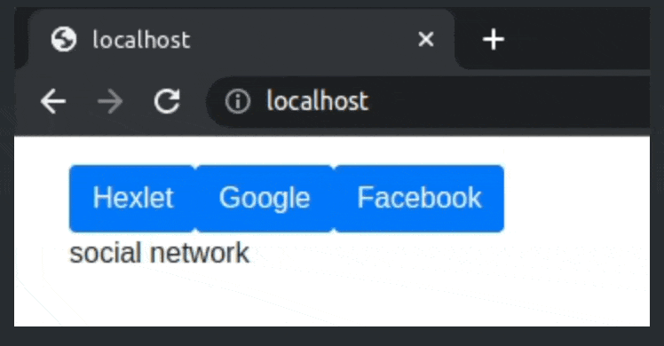

## src/application.js

The module implements a function exported by default that takes in a collection of companies (an example is available in `src/index.js`) and uses the list to generate buttons (a button for each company). 

Clicking a button shows a company description. 

If the description of another company is displayed, the description is replaced by the description of the company whose button has been clicked.

A second click on the same button hides the description.

Hiding the description is implemented without a `hidden` class. The description content is added to and removed from the DOM.

No description is displayed by default.

## Demo



### An example of the initial state

```html
<div class="container m-3">
  <button class="btn btn-primary">
    Hexlet
  </button>
  <button class="btn btn-primary">
    Google
  </button>
  <button class="btn btn-primary">
    Facebook
  </button>
</div>
```

### A state after clicking the second button

```html
<div class="container m-3">
  <button class="btn btn-primary">
    Hexlet
  </button>
  <button class="btn btn-primary">
    Google
  </button>
  <button class="btn btn-primary">
    Facebook
  </button>
  <div>search engine</div>
</div>
```
### A state after clicking the third button - the previous description is replaced

```html
<div class="container m-3">
  <button class="btn btn-primary">
    Hexlet
  </button>
  <button class="btn btn-primary">
    Google
  </button>
  <button class="btn btn-primary">
    Facebook
  </button>
  <div>social network</div>
</div>
```
### A state after clicking the third button a second time - the description is hidden

```html
<div class="container m-3">
  <button class="btn btn-primary">
    Hexlet
  </button>
  <button class="btn btn-primary">
    Google
  </button>
  <button class="btn btn-primary">
    Facebook
  </button>
</div>
```
